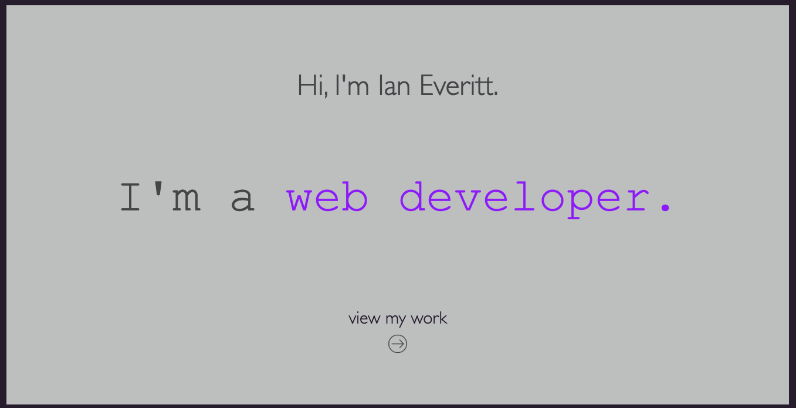
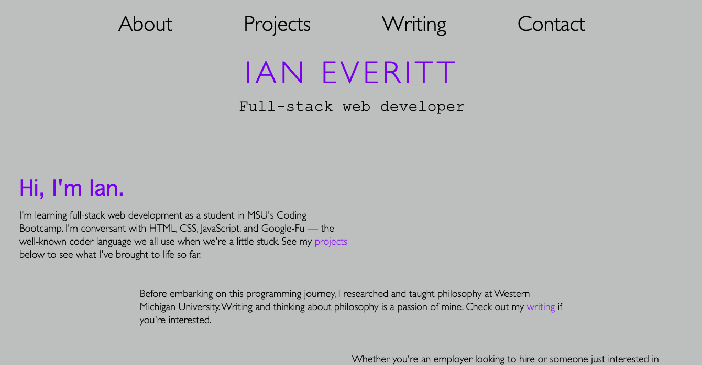
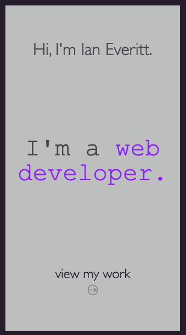
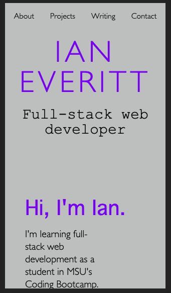

# ian-everitt-portfolio

## My Portfolio
As the title of my repository suggests, this is my personal portfolio. I designed it myself, though I took ideas from various web developers lauded as having some of the best designs. 

In the future, I plan to enrich the user experience by adding things like hover effects to my project buttons. I also intend to link actual projects to my projects buttons (once I have projects to link!). Finally, I indend to clean up my code (especially the stylesheets!) so there aren't any unnecessary classes or repetitious CSS blocks.  

## Deployment 
To visit this website, simply follow this [link](https://rflctveq.github.io/ian-everitt-portfolio/) or enter the following into your address bar: https://rflctveq.github.io/ian-everitt-portfolio/. 

## Screenshots
Here's a partial image of both the splash page and the homepage of my portfolio as seen on a desktop:

And here's a partial image of both as seen on an iPhone 5/SE screen (I chose this size because it's one of the smaller screen sizes and it showcases the reactiveness of my site): 

